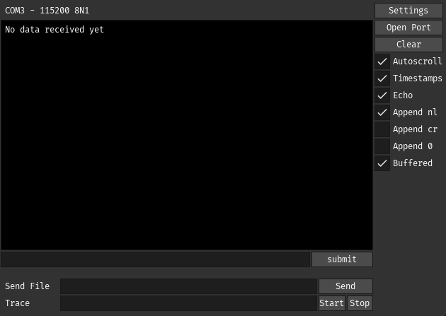
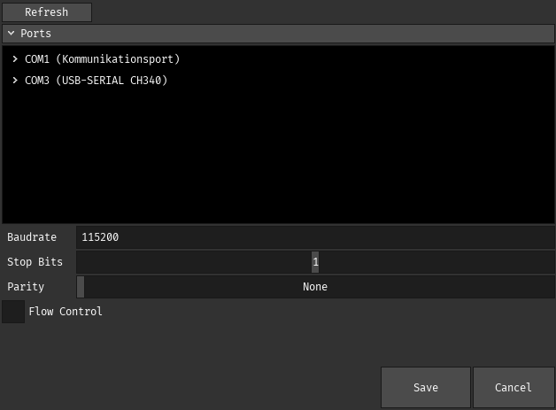
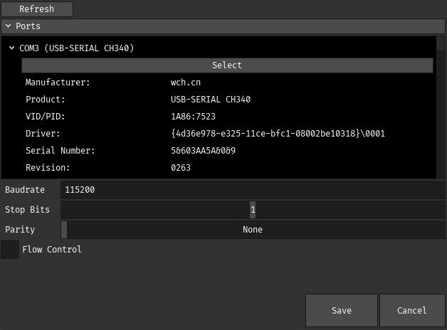

# Torta
Are you tired of everytime you open a serial terminal that you have to check externally which port is what? Well fret no longer! Torta is the sweet terminal to solve all your minor inconviniences.

Torta is simple to use, and mainly (for now) targets commandline-like communication. It supports both a standard buffered mode, and a direct unbuffered(ish) mode. It has niceties such as sending files, tracing all IO to a file, as well as internally timestamping messages. You can also enable/disable appending of some standard codes such as newline, carriage return and a null terminator.

# Port Settings
The main feature of Torta is the detailed port settings view, letting you easily figure out which port to connect to. Keeping in spirit with the main screen, the settings view is simple:

The ports are listed with their user-friendly name. Clicking on a port gives you more details

Showing details you may also be interested in.

# Installation
Torta can be build locally with an Odin compiler, and gcc on Linux or MSVC on Windows. 

Pre-built binaries are available under releases for both Windows and Linux. 